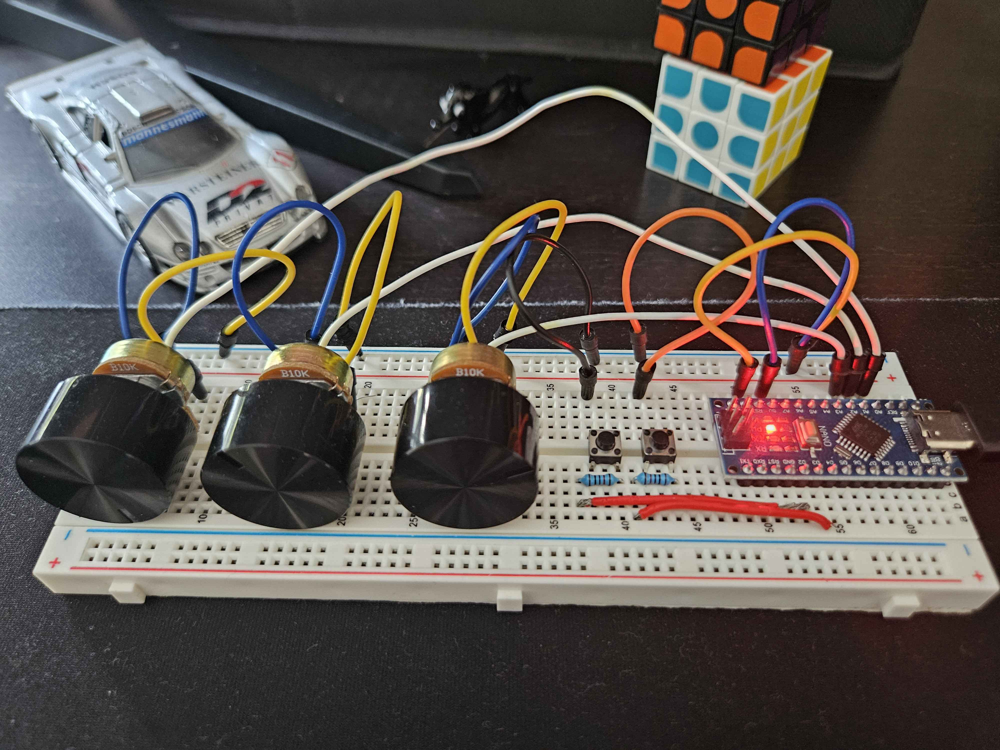

#Simple audio mixer

## material requirements

- Arduino (nano or other)

- 2 button

- 3 potentiometer

- 2 10k resistor

- some cable (ofc)

## Wireing schema

## Wirering result

## Install the arduino script

Upload the stream_deck_nano.ino script using any arduino IDE (normal style)

## Install the pyhton librairy

pip install -r requirements\_<your-os>.txt

## Run the project

After uploading the arduino script run the python script for your os and that's it.

You can use the python script as a systemctl service on linux to get it at any time.

## Licence

A licence for this ?? Hell naaaaah.
